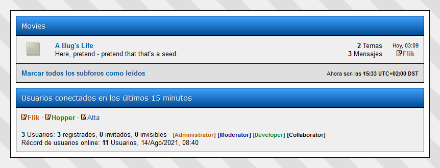

# Color Nick

It allows the coloring of the nickname of one or more users of your miarroba board according to their profile. In addition, it allows the edition of the legend _**[Administrator]**_, **[Moderator]** to explain the meaning of the coloring. 



## Usage

Download [colornick.min.js](colornick.min.js), upload it to the web space of your board, and insert the following code in the html footer (control panel > appearance > HTML): 

```html
<script type="text/javascript" src="/path/to/colornick.min.js"></script>
<script type="text/javascript">
colornick([
    {
        name: "Group 1",
        color: "#FF0000",
        bold: true,
        italic: false,
        users: ["Username1", "Username2" /*, more usernames...*/]
    },
    {
        name: "Group 2",
        color: "#00FF00",
        bold: true,
        italic: false,
        users: ["Username3", "Username4" /*, more usernames...*/]
    }
    /*, more groups...*/
]);
</script>
```

The `colornick` function takes a list of groups, where each group is an object with the following properties:

* `name`: the name of the group,
* `color`: the color of usernames,
* `bold`: a flag to make usernames bold,
* `italic`: a flag to italicize usernames,
* `users`: a list of usernames belonging to the group.

## License

This script is released under the terms of the [BSD 3-Clause License](LICENSE).
